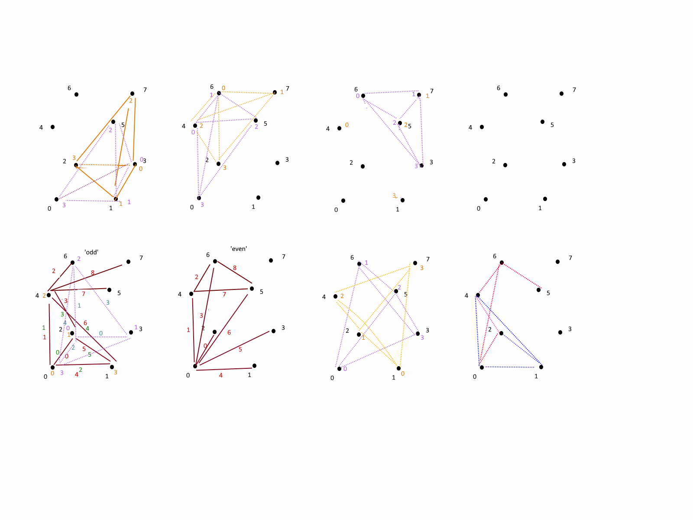

## Marching Diamond Crystal Lattice

### Marching Cubes - sliced with 5 tetrahedrons.

### Marching Tetrahdrons


# Marching Diamond Crystal Lattice Detail




See also

Testing framework : http://mikolalysenko.github.io/Isosurface/

https://github.com/mikolalysenko/isosurface.git

Temporary Testing framework: https://d3x0r.org/javascript/marching-tetrahedron

`Marching Tetrahedra 3 (DLC-Plane)` mode slices a cloud a plane at a time, generating a single calculation for all shared points.  Duduces the point count.

Quad emits do not work, because one of the triangles, sometimes, ends up with an inverted, although the face order is the same as emitting 2 triangles.  It could be a boundary condition in the testing framework that sometimes flips triangels; this is visilble on `Marching Tetrahedra 2 (DCL-Cell)` still emits quads for the intersections between 4 lines; This surface does not have to be flat; there's no correlation between oposing corners that implies this surface is a single plane.

This yields really good results for opening spaces, does not suffer from any discontinuities.
It is simpler if 0 is outside, and < 0 is outside; >0 has density.

in the case of distance to surface as point cloud data, the density is -distance; but then the option to use zero as inside surface must also be selected.

All triangles are trivially aligned with their proper normals.  The accompanying source code is complete; but is less than optimal.

The tetrahedral computation (tetCompute) in this code assumes the following.

The triangle mesher, given any input point, the point is either inside, or outside.  
  - (If 0 is 'inside') If it is inside, the face generation is inverted, and all values inverted.  In the case of 0 the state does not change from 'outside' to 'inside' so the origin point, which is ALWAYS outside, and is the source of computing the delta from 0 to points 1,2, or 3, then those points could also be 0, resulting in a slope that has no delta; this is forced to 0 as a result, so a 0 'inside' point is as close to itself as it can be.
  - (If 0 is 'outside') then, since the first point must be outside, if it is 0, then no inversion takes place.  If it isn't 0, then the delta computation for the slope will never be 0.

The conditions and plane generation can also all be reversed, such that 0 is 'inside' is proper, and the mesher expects the first inpoint point to be inside... which reverse all of the subtractions and >= to < comparisons.

Inspired from cells of diamond crystal lattice...


Instead of blank cells, I have alternating same-cells (the inside
tetrahdron is rotated 90 degrees each time, so the edge deltas are computed
along the same diagonal in mating cells.

My original idea was actually more of a marching - cuboctohedron
https://en.wikipedia.org/wiki/Cuboctahedron
which is formed from trying to densly stack equilateral tetrahedrons... and
then scalling a large stack down, in the middle you end up with 90 degree
cuts...

The cell is actually simpler than that; being a marching-cube, but with the
middle plane of it skewed  0.5 to the right and 'forward'/'up'?  where the
values of the skewed plane are an average of the 8 points around it.  This
ended up being 14 tetrahedrons, with 4 pyramidal penta-hedrons sliced into
2 tetrahedron each... But slicing the pyramids caused a lot of confusion in
mapping inverted/notinverted to the tetrahedra face emission.

the final result was only 5 tetrahedra, and no fabricated points.  (the
above also required a 3x3x2 matrix of values, so the 0.5 skew to the right
1 cell could be calculated)  This only requires the 5 points of the cell
much like yours.

I was iterating through the tet vertices to find one that was 'outside' and
then just always build from an outside point; but depending on ordering of
the vertices that can be tricky; I ordered mine so every other point is
inverted, and a mod4 can be applied to wrap the point indexing, reducing it
to just 1 if case , and its sub-cases...


## Earlier notes building on Diamond lattice framework

This is a parallel-piped cell, which is not what is implemented above.  This adds additional complication to the above, and requires syntesizing a point from other points around it... but not knowing the nature of the coordinates, a pure average of the 8 points around the points required causes creases and indentations, especially on boundaries of the data.  The above method, using 5 tetrahedrons is more appealing from a code simplicity viewpoint, while doing very well at opening void areas.


Provided for historical context.  Other works included rough sketches and models build from Geomag toys.

This is the cuboctohedral approach.... geometrically it ends up the same, because the pyramidal pentahedra have to be slice into two irregular tetrahedra anyway.

```

trying to find the centroid of the tetrahedron..

cos−1(−​1⁄3) = 109.4712206...° ≈ 109.5°

, if C is the centroid of the base, the distance from C to a vertex of the base is twice that from C to the midpoint of an edge of the base

edge = x
  sqrt(2/3) * X
  
  +/- 1 , 0, -1/sqrt(2)
  
  0, +/-1, 1/sqrt(2)
  
  
  cubocotohedron - 16 + 4 + 16   36 lines,       14-28 faces
  hourglass - dual inverted pyramids  16 lines   2-4 faces
  
  15 points skipped
  
  (8 + 4)  * 2  24
  6  * 4  * 2   48
  
  8             80  lines  32 cells
    4 points 12, 12, 8 8  40 radial
  
  
  
  computed from recti-linear 3d space, by synthesizing a center point from the 8 points on the corners of a cell.
  The partitioning of the tetrahedrons provide a high usage of unit tetrahedral cells, and isocolese pyramids.
  It's an impure spacial unit projection; that is, when constructed with physical objects, the aspect ratio is not correct...
  but mathemetically they should be congruent.  A single-axis scaling can be applied to stretch it to unit lengths internally.
  
  
  pyramid tesselation is a composition of 2 tetrahedrons.
  
  geometry of a layer is computed with inter-locked alternating cells.
  
  A single layer does not require points above or below it, but do require a span of points within the layer, and the top and bottom.
  
  var layer = [[[]],[[]]];  //[0][x][y], [1][x][y]
  
  centroid = avergae of [0][x(+1)][y(+1)]+[1][x(+1)][y(+1)]
  
  two passes should result in a sector mesh 1) indepednant, all edges - 1 on x, y... complete mesh on top and bottom.

  this is the array indexes of the 3x top;bottom matrix needed to mesh this area.
  they contain the values at the centroid points of density mesh.


	 // bottom and top layers, of the primary coordinates, and secondary required
	 // missing side, at edge of sector can be assume as infinitly dense or vacuum...  Absolute pressure is 0.
	 // the more dense, the less pressure it excerts.
	 // the more vacuous - the more pressure it pulls with... 


	 
	 // gradient is >0 is dense and 0 and below is vacuum.
	 // (there is no such thing as absolute vacuum)
	 // 0 is ground level atmosphere. 
	 // 0.5 - cork/lithium
	 // 0.8 - woods
	 // 1 is liquid
	 // 1.5 is sand
	 // 1.6 is dirt
	 // 2 is stone/brick
	 // 1.78 is magnesium
	 // 3 is granite
	 // 
	 // 7 density dirt doesn't exist... 
	 // zinc/iron
	 // no particular reasons... 
	 
	 // spacial objects like astoids will be very dense, pushing to the edge of the vacuum space on them... 
  
  
     6 7 8
     3 4 5
     0 1 2
     

    and the resulting 0 crossing value from outside to inside is given as a delta T along the line from one of the points.
	
	// sided-ness ends up purely computed from which is <=0 and >0
	//so number is from -1 to 0, the direction is reversed (from far point)... if from 0-1 the direction is forward from the point.
	
	
	 to have an average computed internally, the next values to the right and above have to also
    be factored into the computation... 
	 
	 a  a  a    a  a  a
     0  0  a    1  1  a
     0  0  a    1  1  a
  
     (0, 0 lower left)
	 
  
  0134
	0,0  +  0,1  +  1,0  +  1,1  +  3,0  +  3,1  +  4,0  +  4,1
	/8
	
  1245	
	1,0  +  1,1  +  2,0  +  2,1  +  4,0  +  4,1  +  5,0  +  5,1
	/8
	
  3467	
    3,0  +  3,1  +  4,0  +  4,1  +  6,0  +  6,1  +  7,0  +  7,1
	/8
	
  4578	
	4,0  +  4,1  +  5,0  +  5,1  +  7,0  +  7,1  +  8,0  +  8,1
	/8
	
	
  0 - bottom pyramid
    1 - back-left tetrahedron
       013,0  0134	
	   
	   * if points are inside/outside...
	   0,0-1,0     1,0-3,0    3,0-0,0    0,0-0134    1,0-0134    3,0-0134
	   
	   
	2 - forward-right tet
       134,0  0134	

	   * if points are inside/outside...
	   1,0-3,0     1,0-0134    3,0-4,0    3,0-0134    4,0-0134    4,0-1,0


  1 - top pyramid
    1 - lower-left tetrahedron
       013,1  0134

	   * if points are inside/outside...
	   0,1-1,1     1,1-3,1    3,1-0,1    0,1-0134    1,1-0134    3,1-0134

	2 - upper-right tet
       134,1  0134	
	   1,1-3,1     1,1-0134    3,1-4,1    3,1-0134    4,1-0134    4,1-1,1
	
  2 - right bottom tet
       14,0  0134 1245 
  3 - right top tet
       14,1  0134 1245 

  4 - forward bottom tet
       34,0  0134 3467
  5 - forward top tet
       34,1  0134 3467

  6 - forward right bottom pyramid
     1 - back-left tet
	    4,0  0134  1245 3467
	 2 - fore-right tet
	    4,0  1245 3467 4578
   
  7 - forward right top pyramid
     1 - back-left tet
	    4,1  0134  1245 3467
	 2 - fore-right tet
	    4,1  1245 3467 4578
	  


  The above also have a fixed geometry
    0  0,0,0  1,0,0   1,0,0 / 1,1,0
	   0.5,0.5,0.5
    1  0,0,1  1,0,1   1,0,1 / 1,1,1
	   0.5,0.5,0.5
	2 1,0,0  1,1,0  0.5,0.5,0.5  1.5,0.5,0.5
	3 1,0,1  1,1,1  0.5,0.5,0.5  1.5,0.5,0.5

	4 0,1,0  1,1,0  0.5,0.5,0.5  0.5,1.5,0.5
	5 0,1,1  1,1,1  0.5,0.5,0.5  0.5,1.5,0.5


    6  1,1,0  0.5,0.5,0.5  1.5,0.5,0.5   0.5,1.5,0.5
	   1,1,0  1.5,0.5,0.5  1.5,1.5,0.5   0.5,1.5,0.5

    7  1,1,1  0.5,0.5,0.5  1.5,0.5,0.5   0.5,1.5,0.5
	   1,1,1  1.5,0.5,0.5  1.5,1.5,0.5   0.5,1.5,0.5
	


ordering of the tetrahedrons matters to generate correctly sided output
there can be a simple invert passed to the mesher in the case of mirror inputs (top/bottom)


   0 1 3 2 

(inverted notes apply to that single point being outside (or notted inside) )
    0    1  (inverted)
    \   /
     \2/    (above page)
 	  |
	  |
	  3  (inverted)
	  


(0,1 outside ... 1,2  2,3  3,0  )
    0    1  // unfinished
    \   /
     \2/ 
 	  |
	  |
	  3  
	  


// changing the order of the points changes the inversion characteristic 90 degrees.
// (odd offset vs even offset)

  (inverted)	  
    0    1 
    \   /
     \3/ 
 	  |
	  |
	  2   (inverted)

// pyramid point ordering


    2 ----- 3
      \   / |
    |  \ /  |
    |   4   |(above page)
    |  / \  |
	  /   \ |
    0 ----- 1
	  
	  
	splits into two ordered tetrahedrons with
	
    0,2,4,1   1,2,4,3
	
	
	
	  
	  
      y                     x -1           1 x
                                1/sqrt(2)
	  1                             |
  x -1  1 x                 
                                    |
     -1                           1/sqrt(2)
      y                           0 y
	  
	  

so cubic cell structure with 45 degree tetrahedral containment

http://lampx.tugraz.at/~hadley/ss1/crystalstructure/structures/diamond/diamond.php

0,0,0   0,0,0       0,1,0   0,4,0       0,2,0   0,8,0
1,0,0   1,2,0       1,1,0   1,6,0       1,2,0   1,10,0
                                        
...                 ...                 ...
2,0,0   2,0,0       2,0,0   2,0,0       2,0,0   2,0,0
...                 ...                 ...
3,0,0   3,2,0       3,0,0   3,2,0       3,0,0   3,2,0

--------------

0,0,1   0,0+1,1       0,1,1   0,4+1,1       0,2,0   0,8+1,1
1,0,1   1,2+1,1       1,1,1   1,6+1,1       1,2,0   1,10+1,1
                                        
...                 ...                 ...
2,0,0   2,0,0       2,0,0   2,0,0       2,0,0   2,0,0
...                 ...                 ...
3,0,0   3,2,0       3,0,0   3,2,0       3,0,0   3,2,0

--------------

0,0,2   0+2,3,2       0,1,1   0+2,7,1       0,2,0   0+2,11,1
1,0,2   1+2,1,2       1,1,1   1+2,5,1       1,2,0   1+2,9,1
                                        
...                 ...                 ...
2,0,0   2,0,0       2,0,0   2,0,0       2,0,0   2,0,0
...                 ...                 ...
3,0,0   3,2,0       3,0,0   3,2,0       3,0,0   3,2,0

--------------

0,0,3   0-1,1,2       0,1,1   0+3,7,1       0,2,0   0+3,11,1
1,0,3   1+3,1,2       1,1,1   1+3,5,1       1,2,0   1+3,9,1
                                        
...                 ...                 ...
2,0,0   2,0,0       2,0,0   2,0,0       2,0,0   2,0,0
...                 ...                 ...
3,0,0   3,2,0       3,0,0   3,2,0       3,0,0   3,2,0


z = 0
   y = 0
      x = x
   y = 1 //y
      x = x + 2
   
z = 1
   x = x + 0.25
   y = y + 0.25

z = 2
   x = x + 0.5
   y = y
   
z = 3
   x = x + 0.75
   y = y + 0.25

z = 4 (0)
   x = x
   y = y


z=0 -> 1
  x = x -> x+0.25
  y = y -> y+0.25
  

```